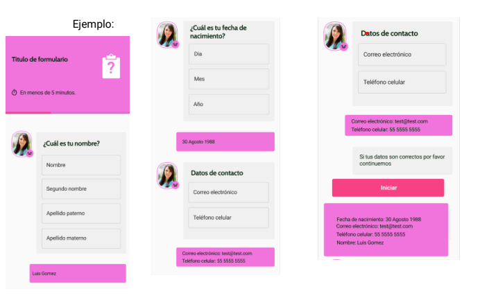

# Formulario tipo chat


Proyecto desarrollado con Vite
> npm init vite@latest

Instalar dependencias
```
npm i 
```

Iniciar un entorno de desarollo
```
npm run dev
```

Para agregar una base de datos es necesario crear el archivo
```
.env
```
Y modificar la variable de entorno
```
VITE_DB_HOST
```

Desplegar Proyecto con:
```
npm run build
```

# Requerimientos del programa

Generar el siguiente formulario en forma de chat construido con componentes
independientes, 
uno para nombre, uno fecha de nacimiento y por último otro para
datos de contacto, al responder cada una de las preguntas deberá mostrar un
recuadro rosa con la información capturada, al finalizar el usuario deberá
presionar el botón “Iniciar”, 
cada uno de los datos deberá mostrar en un recuadro
al final con la información capturada como se muestra y almacenar los datos en
variables de sesión.

Puedes utilizar las **React JS y styled-component** o bootstrap.

